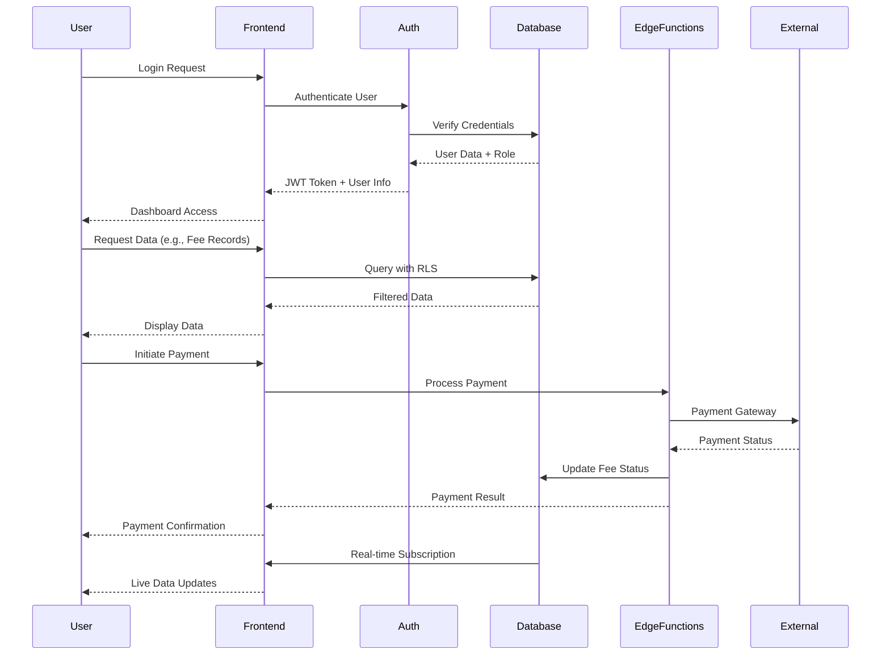
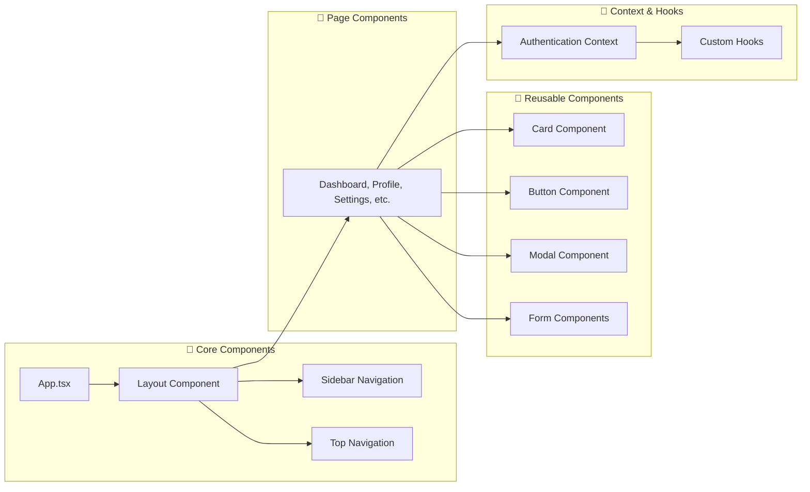
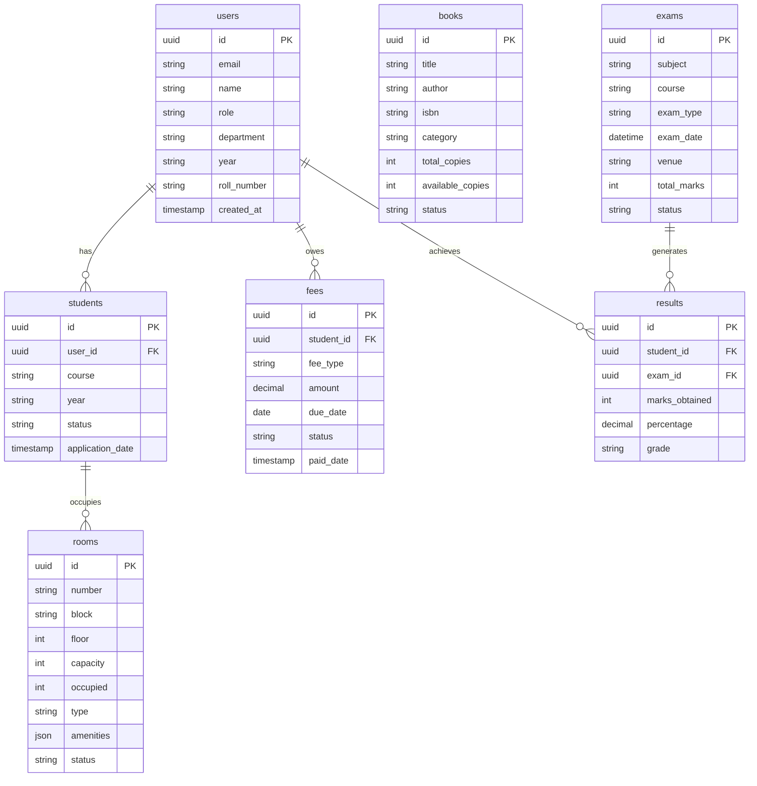

# College ERP Portal - Architecture Flow Diagram

## Complete System Architecture

```mermaid
graph TB
    %% User Layer
    subgraph "👥 Users"
        U1[Student]
        U2[Staff/Faculty]
        U3[Admin]
    end

    %% Frontend Layer
    subgraph "🖥️ Frontend (React + TypeScript)"
        subgraph "📱 UI Components"
            LOGIN[Login Page]
            DASH[Dashboard]
            PROFILE[Profile Management]
            SETTINGS[Settings]
        end
        
        subgraph "🎓 Academic Modules"
            ADMIT[Admissions Management]
            EXAM[Examinations & Results]
            LIB[Library Management]
        end
        
        subgraph "💰 Financial & Facilities"
            FEES[Fee Management]
            HOSTEL[Hostel Management]
        end
        
        subgraph "🔧 Core Services"
            AUTH_CTX[Auth Context]
            ROUTER[React Router]
            COMPONENTS[Reusable Components]
        end
    end

    %% Styling Layer
    subgraph "🎨 Styling & UI"
        TAILWIND[Tailwind CSS]
        ICONS[Lucide React Icons]
        RESPONSIVE[Responsive Design]
    end

    %% Backend Layer
    subgraph "☁️ Supabase Backend"
        subgraph "🔐 Authentication"
            AUTH[Supabase Auth]
            RLS[Row Level Security]
            SESSIONS[Session Management]
        end
        
        subgraph "🗄️ Database (PostgreSQL)"
            T1[users table]
            T2[students table]
            T3[books table]
            T4[fees table]
            T5[exams table]
            T6[results table]
            T7[rooms table]
            T8[admissions table]
        end
        
        subgraph "⚡ Real-time Features"
            REALTIME[Real-time Subscriptions]
            WEBHOOKS[Webhooks]
        end
        
        subgraph "🔧 Edge Functions"
            PAYMENT_FUNC[Payment Processing]
            REPORT_FUNC[Report Generation]
            NOTIFICATION_FUNC[Notifications]
        end
        
        subgraph "📁 Storage"
            FILES[File Storage]
            DOCUMENTS[Document Management]
        end
    end

    %% Deployment Layer
    subgraph "🚀 Deployment & Hosting"
        BOLT_HOST[Bolt Hosting]
        CDN[Global CDN]
        SSL[SSL Certificate]
    end

    %% Development Tools
    subgraph "🛠️ Development Stack"
        VITE[Vite (Build Tool)]
        TYPESCRIPT[TypeScript]
        ESLINT[ESLint]
        NODE[Node.js]
    end

    %% External Services
    subgraph "🌐 External Integrations"
        PAYMENT_GATEWAY[Payment Gateway]
        EMAIL[Email Service]
        SMS[SMS Service]
    end

    %% User Flow Connections
    U1 --> LOGIN
    U2 --> LOGIN
    U3 --> LOGIN

    %% Frontend Internal Connections
    LOGIN --> AUTH_CTX
    AUTH_CTX --> ROUTER
    ROUTER --> DASH
    ROUTER --> PROFILE
    ROUTER --> SETTINGS
    ROUTER --> ADMIT
    ROUTER --> EXAM
    ROUTER --> LIB
    ROUTER --> FEES
    ROUTER --> HOSTEL

    %% Styling Connections
    TAILWIND --> LOGIN
    TAILWIND --> DASH
    TAILWIND --> PROFILE
    TAILWIND --> SETTINGS
    TAILWIND --> ADMIT
    TAILWIND --> EXAM
    TAILWIND --> LIB
    TAILWIND --> FEES
    TAILWIND --> HOSTEL
    ICONS --> COMPONENTS

    %% Frontend to Backend Connections
    AUTH_CTX --> AUTH
    ADMIT --> T2
    ADMIT --> T8
    EXAM --> T5
    EXAM --> T6
    LIB --> T3
    FEES --> T4
    HOSTEL --> T7
    PROFILE --> T1
    DASH --> T1
    DASH --> T2
    DASH --> T3
    DASH --> T4
    DASH --> T5
    DASH --> T7

    %% Backend Internal Connections
    AUTH --> T1
    RLS --> T1
    RLS --> T2
    RLS --> T3
    RLS --> T4
    RLS --> T5
    RLS --> T6
    RLS --> T7
    RLS --> T8

    %% Real-time Connections
    REALTIME --> DASH
    REALTIME --> HOSTEL
    REALTIME --> LIB

    %% Edge Functions Connections
    FEES --> PAYMENT_FUNC
    PAYMENT_FUNC --> PAYMENT_GATEWAY
    NOTIFICATION_FUNC --> EMAIL
    NOTIFICATION_FUNC --> SMS

    %% Deployment Connections
    VITE --> BOLT_HOST
    BOLT_HOST --> CDN
    CDN --> U1
    CDN --> U2
    CDN --> U3

    %% Styling
    classDef userClass fill:#e1f5fe,stroke:#01579b,stroke-width:2px
    classDef frontendClass fill:#f3e5f5,stroke:#4a148c,stroke-width:2px
    classDef backendClass fill:#e8f5e8,stroke:#1b5e20,stroke-width:2px
    classDef deployClass fill:#fff3e0,stroke:#e65100,stroke-width:2px
    classDef toolClass fill:#fce4ec,stroke:#880e4f,stroke-width:2px

    class U1,U2,U3 userClass
    class LOGIN,DASH,PROFILE,SETTINGS,ADMIT,EXAM,LIB,FEES,HOSTEL,AUTH_CTX,ROUTER,COMPONENTS,TAILWIND,ICONS,RESPONSIVE frontendClass
    class AUTH,RLS,SESSIONS,T1,T2,T3,T4,T5,T6,T7,T8,REALTIME,WEBHOOKS,PAYMENT_FUNC,REPORT_FUNC,NOTIFICATION_FUNC,FILES,DOCUMENTS backendClass
    class BOLT_HOST,CDN,SSL deployClass
    class VITE,TYPESCRIPT,ESLINT,NODE,PAYMENT_GATEWAY,EMAIL,SMS toolClass
```

## 📊 Data Flow Architecture



## 🏗️ Component Architecture



## 💾 Database Schema Overview



## 🔄 Cost-Effective Architecture Benefits

### 💰 Free Tier Utilization
- **Supabase**: 500MB database, 50MB file storage, 2GB bandwidth
- **Bolt Hosting**: Free static site hosting with global CDN
- **Development**: Free open-source tools (Vite, React, TypeScript)

### 📈 Scalability Path
1. **Phase 1**: Free tiers (0-100 users)
2. **Phase 2**: Supabase Pro ($25/month) (100-10K users)
3. **Phase 3**: Custom scaling as needed

### ⚡ Performance Optimizations
- Static site generation for fast loading
- CDN distribution for global performance
- Real-time updates only where needed
- Efficient database queries with RLS

## 🛠️ Technology Stack Summary

| Layer | Technology | Purpose | Cost |
|-------|------------|---------|------|
| **Frontend** | React + TypeScript | UI Framework | Free |
| **Styling** | Tailwind CSS | Styling Framework | Free |
| **Icons** | Lucide React | Icon Library | Free |
| **Build Tool** | Vite | Development & Build | Free |
| **Backend** | Supabase | Database + Auth + API | Free Tier |
| **Hosting** | Bolt Hosting | Static Site Hosting | Free |
| **Domain** | Custom Domain | Professional URL | ~$10/year |

**Total Monthly Cost**: $0 (Free Tier) → $25/month (When scaling)